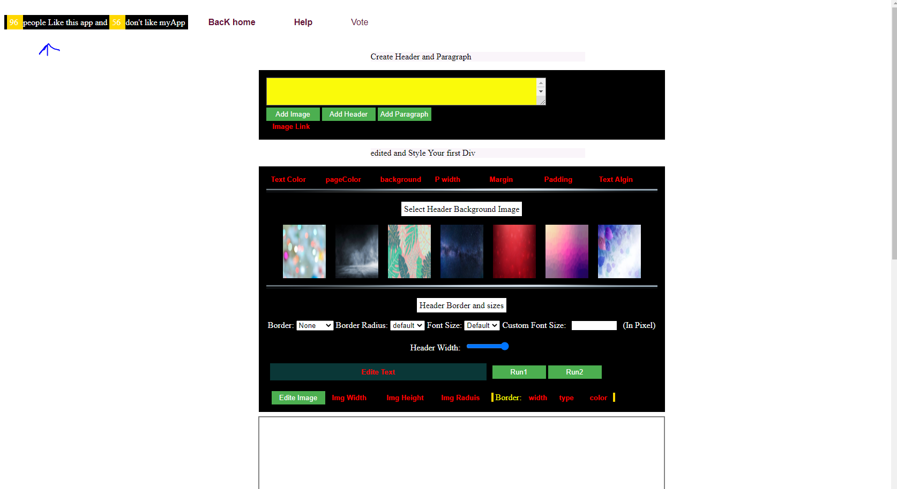

# data_analysis_codeEditor
This Project Contains my  Editor (NoCode Editor) + and Small use of data analysis Using SQLite 3 to Execute SQL query on the database and fetch the data in order to know how many likes , and dislikes , also there is a post function to make your vote If you like my App click I like, In order this app to run you have to download gitbash and run vagrant up on the project directory then vagrant init then cd the directory and run python database_setup.py then python __init__.py then visit  http://127.0.0.1:5000/editor/ and Enjoy the App (the main reason is the data analysis until now )

## Note In order the app to work
please after clone the project create new dir called my project and inside it
create another dircotry called templates and add inside it .html files (voting.html, editor.html)

## screenshot:

